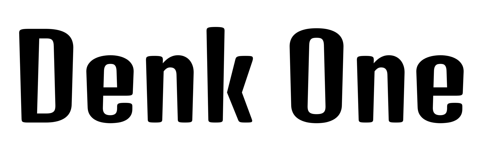
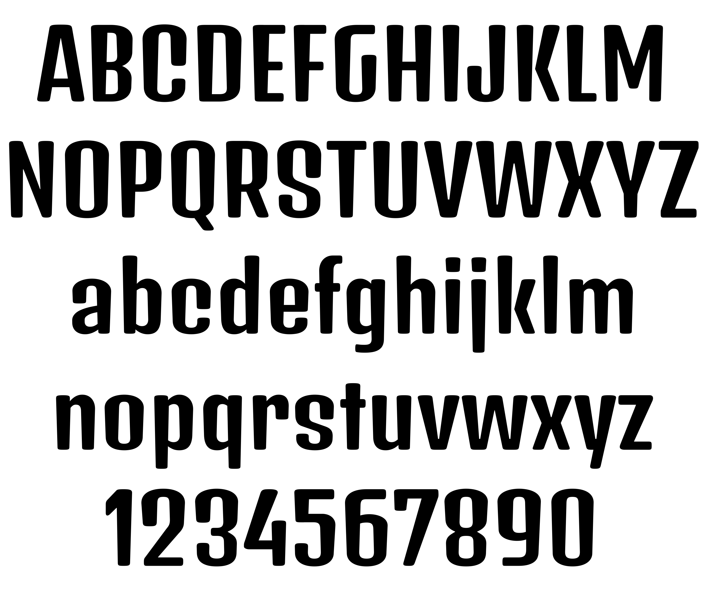
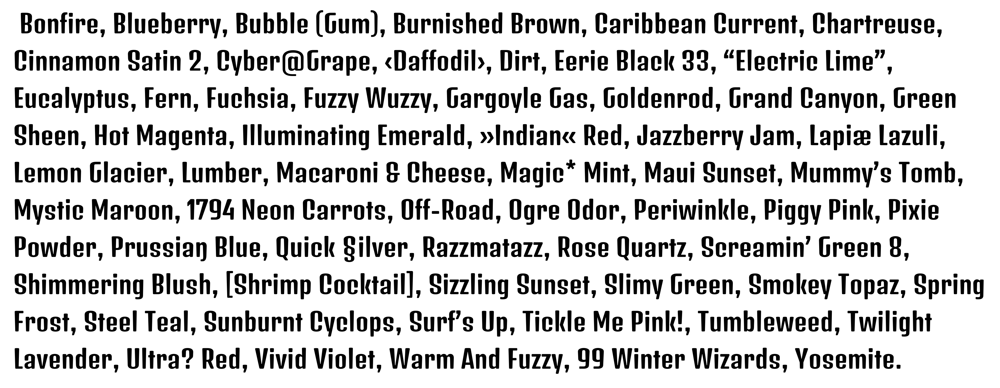

# Denk One

Denk is a medium contrast display sans serif. It was inspired by a hand painted German sign. Inder has been carefully adjusted to the restrictions of the screen. Despite having display characteristics Denk can be used in a wide range of sizes.

Denk One is a Unicode typeface family that supports languages that use the Latin script and its variants, and could be expanded.

More specifically, this release supports the following codepages: 
Latin-1, Latin-2, Turkish, Windows Baltic, Windows Vietnamese, Macintosh Character Set

The following Unicode ranges are supported:
Basic Latin, Latin-1 Supplement, Latin Extended-A, Latin Extended-B, IPA Exetnsions, 
Spacing Modifier letters, Combining Diacritical Marks, Greek, Devanagari, 
Latin Extended Additional, General Puctuation, Superscripts and Subscripts, 
Currency Symbols, Letterlike Symbols, Number Forms, Arrows, Mathematical Operators, 
Geometric Shapes, Miscelanious Symbols, Dingbats, Alphabetic presentation forms

## Authors

N: Irina Smirnova
E: irina.v.sm@gmail.com
D: Designer

N: Eben Sorkin
E: sorkineben@gmail.com
W: www.sorkintype.com
D: Mastering

## Building

Fonts are built automatically by GitHub Actions - take a look in the "Actions" tab for the latest build.

If you want to build fonts manually on your own computer:

* `make build` will produce font files.
* `make test` will run [FontBakery](https://github.com/googlefonts/fontbakery)'s quality assurance tests.
* `make proof` will generate HTML proof files.

## Changelog

When you update your font (new version or new release), please report all notable changes here, with a date.
[Font Versioning](https://github.com/googlefonts/gf-docs/tree/main/Spec#font-versioning) is based on semver. 

**Date + Version**

## License

This Font Software is licensed under the SIL Open Font License, Version 1.1.
This license is available with a FAQ at
https://scripts.sil.org/OFL

## Repository Layout

This font repository structure is inspired by [Unified Font Repository v0.3](https://github.com/unified-font-repository/Unified-Font-Repository), modified for the Google Fonts workflow.
